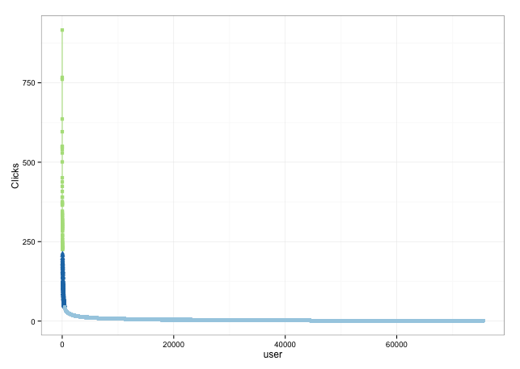

# ビジネスに導入する機械学習

## 参考URL

### R言語

R言語の構文などなど

* [ドットインストール R言語](http://dotinstall.com/lessons/basic_r)
* [biostatistics](http://stat.biopapyrus.net/)

### サポートページ

CSVファイルのダウンロード等

* [データサイエンティスト養成読本　機械学習入門編 サポートページ](http://gihyo.jp/book/2015/978-4-7741-7631-4/support)


### Rのインストール

MacOSXおんりーです

* [MacOSX に homebrew で R をインストール](http://qiita.com/dkkoma/items/8b45ce94c2c5d89d567f)
* [R Studio](https://www.rstudio.com/products/rstudio/download/)


### クラスタリングイメージ

Jsを使ったイメージです。わかりやすいと思います。

* [K-means 法を D3.js でビジュアライズしてみた](http://tech.nitoyon.com/ja/blog/2013/11/07/k-means/)

## 書籍のコード コピペ欄

P40からスタート

### データの読み込み・準備

```r
# installは下記用にパッケージ名を記載してインストール
# install.packages("rpart")

## 使用するlibraryを読み込み
library('data.table')
library('foreach')
library('dplyr')
library('ggplot2')
library('ykmeans')
library('reshape2')
library('rpart')
# library('rattle') # 何故かインストールできない(´・ω・`)

## データを読み込み
click.data <- as.data.frame(fread('click_data_sample.csv'))


## 先頭6行表示
head(click.data)
             click.at user.id campaign.id
1 2015-04-27 20:40:40  144012 Campaign077
2 2015-04-27 00:27:55   24485 Campaign063
3 2015-04-27 00:28:13   24485 Campaign063
4 2015-04-27 00:33:42   24485 Campaign038
5 2015-04-27 01:00:04   24485 Campaign063
6 2015-04-27 16:10:29  145066 Campaign103
```


#### ユーザー毎のクリック数集計
```r
click.user.data <-
  click.data %>%                             # 集計対象
  group_by(user.id) %>%                      # user.idでグループ化
  summarise(click.num=length(click.at)) %>%  # クリック数の集計
  as.data.frame() %>%                        # data.frameに戻す
  arrange(desc(click.num)) %>%               # click.numの降順ソート
  mutate(no=1:length(user.id))               # click.numのランキングをつける

head(click.user.data)
  user.id click.num no
1   22975       916  1
2   30292       767  2
3  107624       761  3
4   41760       636  4
5  121150       596  5
6  104681       550  6

```


### クリック数分布のグラフ作成

[最高のまとめ（と思う）](http://d.hatena.ne.jp/triadsou/20100528/1275042816)

```r
ggplot(click.user.data, aes(x=no, y=click.num)) + # 第一引数はデータ、第二はデータの
  geom_line() +     # 折れ線
  geom_point() +    # 散布図
  xlab('user') +    # x軸名
  ylab('Clicks') +  # y軸名
  theme_bw()        # テーマを設定する（何もなければデフォ）

## 上位5000件のグラフ作成
ggplot(click.user.data[1:5000,], aes(x=no, y=click.num)) +
  geom_line() +
  geom_point() +
  xlab('user') +
  ylab('Clicks') +
  theme_bw()
```


```r
## クラスタリング ... 30秒〜1分ぐらいかかる
click.user.data <- ykmeans(click.user.data, 'click.num', 'click.num', 3)

## クラスタに所属する人数
table(click.user.data$cluster)

    1     2     3 
75104   378    63 


## クリック数分布を描画
ggplot(click.user.data[1:5000,], aes(x=no, y=click.num, col=as.factor(cluster), shape=as.factor(cluster))) +
  geom_line() +
  geom_point() +
  xlab('user') +
  ylab('Clicks') +
  theme_bw() +
  theme(legend.position='none') +
  scale_color_brewer(palette='Paired')
```



```r
ggplot(click.user.data, aes(x=no, y=click.num, col=as.factor(cluster), shape=as.factor(cluster))) +
  geom_line() +
  geom_point() +
  xlab('user') +
  ylab('Clicks') +
  theme_bw() +
  theme(legend.position='none') +
  scale_color_brewer(palette='Paired')

## Rplot10
```


```r
## ミドル以上のユーザーを抽出
target.click.user <-
  click.user.data %>%
  filter(cluster >=2)

## 元データをミドル以上に絞る
click.data <-
  click.data %>%
  filter(user.id %in% target.click.user$user.id)
```


### "大きさ"でクラスタリング

```r
## キャンペーンごとに集計
click.data.campaign <-
  click.data %>%
  group_by(user.id, campaign.id) %>%
  summarise(click.num=length(click.at)) %>%
  as.data.frame()

## キャンペーンを列に展開
click.data.cast <- as.data.frame(
  dcast.data.table(data = as.data.table(click.data.campaign),
  formula = user.id~campaign.id,
  value.var = 'click.num',
  fun.aggregate = sum)
)

## 総クリック数の算出
click.data.cast$total <- rowSums(click.data.cast[, -1])

## 出力
head(click.data.cast, 2)

```


#### クラスタリングの実行
```r
click.data.cast1 <- click.data.cast

## クラスタリングに使う変数
## name 列名を取得する
keys <- names(click.data.cast1)[-c(1, ncol(click.data.cast1))]


## クラスタリングの実行
click.data.cast.cluster1 <- ykmeans(click.data.cast1, keys, 'total', 3:6)

## クラスタの人数確認
table(click.data.cast.cluster1$cluster)

  1   2   3 
353  53  35 
```


#### クラスタごとのキャンペーンの平均クリック数分布
```r
## melt 指定した列名以外の列をvariable列に格納される。対応する値がvalue列に入る。
click.data.cast.cluster1.melt <- melt(
  click.data.cast.cluster1,
  id.vars = c('user.id', 'cluster'),
  measure.vars = keys
)

head(click.data.cast.cluster1.melt)
  user.id cluster    variable value
1     507       1 Campaign001     0
2     510       1 Campaign001     0
3     897       1 Campaign001     0
4     991       1 Campaign001     0
5    1663       1 Campaign001     0
6    1871       1 Campaign001     0

## 平均分布を作成
click.cluster1.summary <-
  click.data.cast.cluster1.melt %>%
  group_by(cluster, variable) %>%
  summarise(value=mean(value)) %>%
  as.data.frame()

## 折れ線グラフでの描画 10秒ぐらい
ggplot(click.data.cast.cluster1.melt, aes(x=variable, y=value, col=as.factor(user.id), group=user.id)) +
  geom_line() +
  geom_point() +
  xlab('Campaign') +
  ylab('Click num') +
  scale_x_discrete(label='') +
  theme_bw() +
  theme(legend.position='noe')

## Rplot11
```

```r
## 因子ベクトルを作成
click.cluster1.summary$cluster <- as.factor(click.cluster1.summary$cluster)

ggplot(click.cluster1.summary, aes(x=variable, y=value, col=cluster, group=cluster, shape=cluster)) +
  geom_line(lwd=1) +
  geom_point(size=4) +
  xlab('Campaign') +
  ylab('Click num') +
  scale_x_discrete(label='') +
  theme_bw() +
  theme(legend.position='top') +
  scale_color_brewer(palette='Paired')

## Rplot13
```

```r
## クラスタ別ユーザー別キャンペーン別に集計
## Rplot15
ggplot(click.data.cast.cluster1.melt, aes(x=variable, y=value, col=as.factor(user.id), group=user.id)) +
  geom_line() +
  geom_point() +
  xlab('Campaign') +
  ylab('Click num') +
  scale_x_discrete(label='') +
  facet_grid(cluster~.) +
  theme_bw() +
  theme(legend.position='none')

## クラスタ別ユーザー別キャンペーン別クリック数の平均値
click.cluster1.summary2 <-
  click.data.cast.cluster1 %>%
  group_by(cluster) %>%
  summarise(click.avg=mean(total)) %>%
  as.data.frame()

click.cluster1.summary2
  cluster click.avg
1       1  82.68839
2       2 262.18868
3       3 342.54286


## 平均値の描画
$ Rplot16
ggplot(click.cluster1.summary2, aes(x=cluster, y=click.avg)) +
  geom_bar(stat='identity', fill='grey') +
  theme_bw()

```

## 形に着目してセグメント化


```r
## 比率に変換
click.data.cast2 <- click.data.cast
click.data.cast2[,keys] <- click.data.cast2[,keys] / click.data.cast2$total

## クラスタリングの実行
click.data.cast.cluster2 <- ykmeans(click.data.cast2, keys, 'total', 3:6)

## 何故か教科書と違う結果に・・・・？
table(click.data.cast.cluster2$cluster)
 1   2   5   6 
 23  20  19 379 


## もういっかい最初からやったら同じ値になった
> click.data.cast2 <- click.data.cast
> click.data.cast2[,keys] <- click.data.cast2[,keys] / click.data.cast2$total
> click.data.cast.cluster2 <- ykmeans(click.data.cast2, keys, 'total', 3:6)
> table(click.data.cast.cluster2$cluster)

  1   2   3   4 
 75 100 123 143 
```

クラスタ毎のキャンペーンの平均クリック数
```r
click.data.cast.cluster2.melt <- melt(
  click.data.cast.cluster2,
  id.vars = c('user.id', 'cluster'),
  measure.vars = keys
)

click.cluster2.summary <-
  click.data.cast.cluster2.melt %>%
  group_by(cluster, variable) %>%
  summarise(value=mean(value)) %>%
  as.data.frame()

```

### ユーザー別キャンペーン別クリック比率の描画
```r
ggplot(click.data.cast.cluster2.melt, aes(x=variable, y=value, col=as.factor(user.id), group=user.id)) +
  geom_line() +
  geom_point() +
  xlab('Campaign') +
  ylab('Click ratio') +
  scale_x_discrete(label='') +
  theme_bw() +
  theme(legend.position='none')
## Rplot17
## Rplot23
```

### 比率クラスタ別キャンペーン別クリック数比率
```r
click.cluster2.summary$cluster <- as.factor(click.cluster2.summary$cluster)

## Rplot24
ggplot(click.cluster2.summary, aes(x=variable, y=value, col=cluster, group=cluster, shape=cluster)) +
  geom_line() +
  geom_point(size=4) +
  scale_x_discrete(label='') +
  theme_bw() +
  theme(legend.position='top') +
  scale_color_brewer(palette='Paired')
## Rplot19
```


### クラスタ別ユーザー別の特徴を描画

```r
## Rplot25
ggplot(click.data.cast.cluster2.melt, aes(x=variable, y=value, col=as.factor(user.id), group=user.id)) +
  geom_line() +
  geom_point() +
  xlab('Campaign') +
  ylab('Click ratio') +
  scale_x_discrete(label='') +
  facet_grid(cluster~.) +
  theme_bw() +
  theme(legend.position='noe')
## Rplot20
```


### クラスタ別クリック数の平均を算出

```r
click.cluster2.summary2 <-
  click.data.cast.cluster2 %>%
  group_by(cluster) %>%
  summarise(click.avg=mean(total)) %>%
  as.data.frame()

click.cluster2.summary2
 cluster click.avg
1       1  48.60870
2       2  49.05000
3       5  59.68421
4       6 136.78364

## Rplot21
## Rplot26
ggplot(click.cluster2.summary2, aes(x=cluster, y=click.avg)) +
  geom_bar(stat='identity', fill='grey') +
  theme_bw()
```


## 特徴的な傾向に着目してセグメント化する

```r
click.data.cast3 <- click.data.cast
click.data.cast3[,keys] <- click.data.cast3[,keys] / click.data.cast3$total

## PCA
click.data.cast3.pc <-
  as.data.frame(prcomp(click.data.cast3[,keys], scale=T)$x)

click.data.cast3.pc$user.id <- click.data.cast3$user.id
click.data.cast3.pc$total <- click.data.cast3$total
pc.keys <- names(click.data.cast3.pc)[1:length(keys)]

## クラスタリングの実行
click.data.cast.cluster3 <- ykmeans(click.data.cast3.pc, pc.keys, 'total', 3:6)
table(click.data.cast.cluster3$cluster)

  1   2   3   4   5   6 
 35  50  75 131 149   1 
```


クラスタ別キャンペーン別の平均値を算出

```r
click.data.cast3$cluster <- click.data.cast.cluster3$cluster
click.data.cast.cluster3.melt <- melt(
  click.data.cast3,
  id.vars = c('user.id', 'cluster'),
  measure.vars = keys
)

click.cluster3.summary <-
  click.data.cast.cluster3.melt %>%
  group_by(cluster, variable) %>%
  summarise(value=mean(value)) %>%
  as.data.frame()
```


クラスタ別ユーザー別の分布を描画

```r
click.cluster3.summary$cluster <- as.factor(click.cluster3.summary$cluster)

## Rplot28
ggplot(click.cluster3.summary, aes(x=variable, y=value, col=cluster, group=cluster, shape=cluster)) +
  geom_line() +
  geom_point(size=4) +
  scale_x_discrete(label='') +
  theme_bw() +
  theme(legend.position='top') +
  scale_color_brewer(palette='Paired')
```


クラスタ別ユーザー別キャンペーンクリック数の分布
```r
## Rplot29
ggplot(click.data.cast.cluster3.melt, aes(x=variable, y=value, col=as.factor(user.id), group=user.id)) +
  geom_line() +
  geom_point() +
  xlab('Campaign') +
  ylab('Click ratio') +
  scale_x_discrete(label='') +
  facet_grid(cluster~.) +
  theme_bw() +
  theme(legend.position='none')
```

平均

```r
click.cluster3.summary2 <- 
  click.data.cast3 %>%
  group_by(cluster) %>%
  summarise(click.avg=mean(total)) %>%
  as.data.frame()

click.cluster3.summary2
  cluster click.avg
1       1  56.17143
2       2  64.90000
3       3  73.90667
4       4 119.81679
5       5 190.78523
6       6 197.00000


## Rplot30
ggplot(click.cluster3.summary2, aes(x=cluster, y=click.avg)) +
  geom_bar(stat='identity', fill='grey') +
  theme_bw()
```


## 教師あり学習によるKPIに寄与するセグメントの抽出


```r
variable.data <- as.data.frame(rbind_all(foreach(k=3:6) %do% {
  # クラスタリングの実行
  cluster.data1 <- ykmeans(click.data.cast1, keys, 'total', k)[,c('user.id', 'cluster')]
  cluster.data2 <- ykmeans(click.data.cast2, keys, 'total', k)[,c('user.id', 'cluster')]
  cluster.data3 <- ykmeans(click.data.cast3.pc, pc.keys, 'total', k)[,c('user.id', 'cluster')]

  # 
  cluster.data1$cluster.type <- sprintf('size.%s.cluster', k)
  cluster.data2$cluster.type <- sprintf('prop.%s.cluster', k)
  cluster.data3$cluster.type <- sprintf('pca.%s.cluster', k)

  # 
  rbind_all(list(cluster.data1, cluster.data2, cluster.data3))
}))

variable.data.cast <- as.data.frame(
  dcast.data.table(data = as.data.table(variable.data),
    formula = user.id~cluster.type,
    value.var = 'cluster'
  )
)
head(variable.data.cast)
  user.id pca.3.cluster pca.4.cluster pca.5.cluster pca.6.cluster prop.3.cluster prop.4.cluster
1     507             2             2             3             4              1              2
2     510             3             4             5             6              1              2
3     897             2             3             3             4              2              3
4     991             2             3             3             4              2              3
5    1663             2             2             3             4              1              2
6    1871             3             4             4             5              3              4
```


CVRデータの作成

```r
cv.data <- as.data.frame(fread('cv_data_sample.csv'))
target.cv.data <-
  cv.data %>%
  group_by(user.id) %>%
  summarise(cv.num=length(cv.at)) %>%
  as.data.frame()

target.cvr.data <-
  as.data.frame(
    merge(as.data.table(target.click.user[,c('user.id', 'click.num')]),
      as.data.table(target.cv.data),
      by='user.id',
      all.x=T
    )
  )

target.cvr.data[is.na(target.cvr.data)] <- 0
target.cvr.data$cvr <- target.cvr.data$cv.num /target.cvr.data$click.num
```


説明変数データの結合
```r
target.data <-
  as.data.frame(
    merge(as.data.table(variable.data.cast),
      as.data.table(target.cvr.data[,c('user.id','cvr')]),
      by='user.id',
      all.x=T
    )
  )
target.data[is.na(target.data)] <- 0
```

予測モデルの構築
```r
target.data <-
  as.data.frame(
    merge(as.data.table(variable.data.cast),
      as.data.table(target.cvr.data[,c('user.id', 'cvr')]),
      by='user.id',
      all.x=T
    )
  )

target.data[is.na(target.data)] <- 0
```


決定木の描画
```r
## 訂正がありました
## fancyRpartPlot(cvr.fit)

library(rpart)   # 決定木
library(rattle)  # きれいな決定木の描画

## クラスタ番号を因子型に変換
target.data[,-c(1,ncol(target.data))] <- 
  apply(target.data[,-c(1,ncol(target.data))], 2, as.factor)

## 決定木の実行
## うまくプロットされない(´・ω・`)
cvr.fit <- rpart(cvr~., data=target.data[,-1])
```


クラスタリングの実行
```r
## クラスタリングの実行
click.data.cast.cluster3 <- ykmeans(click.data.cast3.pc, pc.keys, 'total', 6)

## クラスタリング番号の付与
click.data.cast3$cluster <- click.data.cast.cluster3$cluster

## 縦持ちのデータに変換
click.data.cast.cluster3.melt <- melt(
  click.data.cast3,
  id.vars = c('user.id', 'cluster'),
  measure.vars = keys
)

click.cluster3.summary <-
  click.data.cast.cluster3.melt %>%
  group_by(cluster, variable) %>%
  summarise(value=mean(value)) %>%
  as.data.frame()
```

クラスタ別の特徴を描画
```r
click.cluster3.summary$cluster <- as.factor(click.cluster3.summary$cluster)

## 描画
## Rplot32
ggplot(click.cluster3.summary, aes(x=variable, y=value, col=cluster, group=cluster, shape=cluster)) +
  geom_line() +
  geom_point(size=4) +
  scale_x_discrete(label='') +
  theme_bw() +
  theme(legend.position='top') +
  scale_color_brewer(palette='Paired')

```


